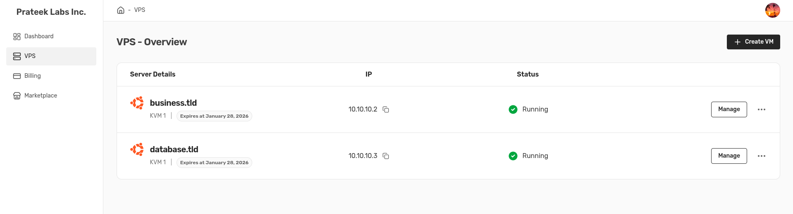

# Mini-VPS-Provider-Clone

The Aim of this project is to mimic the VM orchestration and billing logic to create a mini version of VPS Provider. This project is created to better understand what happens underneath when we go to the VPS provider and create instances. The inspiration of this project is Hostinger's VPS Service. This project is trying to mimic the flow of Hostinger's instance creation, instance state handling and management of firewalls. 



## Architecture of Mini VPS Clone 

```
          -------------------
          |                 |
          |     Frontend    |
          |                 |
          -------------------
                  ^
                  |
          -------------------
          |                 |
          |     Backend     |
          |                 |
          -------------------
                  ^
                  |
          -------------------
          |                 |
          |     lxd_agent   |
          |                 |
          -------------------
                  ^
                  |
          -------------------
          |                 |
          |   LXD REST API  |
          |                 |
          -------------------
```

The project is divided into 4 sections.

- frontend
- backend
- lxd_agent
- LXD REST API

### Frontend

Handles UI/UX logic, fronted request for data to backend and backend gives data back to frontend


### Backend

Responsible for all business logic like billing etc. This section communicates with lxd_agent for instance related information and sends back the information to frontend 


> [!NOTE]
> Backend is only responsible for handling business logic like auth, billing etc.


### lxd_agent

Handles instance creation, deletion, start, stop, delete etc. lxd_agent work is to interact directly with LXD's REST API and perform operations requested by backend 


### LXD REST API

LXD Provides REST API to interact with LXD. This is being used by lxd_agent to request instance information and update instance state.

> [!NOTE]
> Architecture is designed in a way that backend or frontend can not directly interact with LXD's REST API

